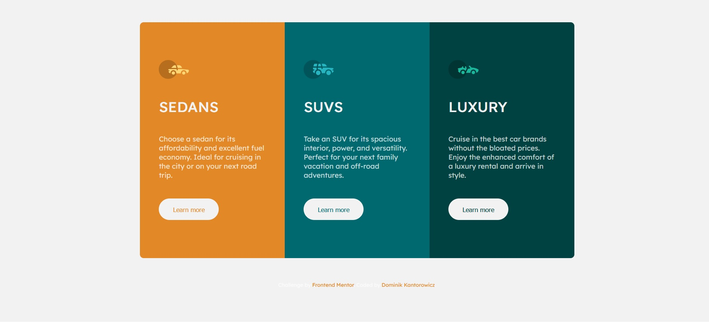

# Flex column layout

This is a solution to the [3-column preview card component challenge on Frontend Mentor](https://www.frontendmentor.io/challenges/3column-preview-card-component-pH92eAR2-).

### Built with

-   HTML5
-   CSS
    -   BEM Methodology
    -   Variables
-   Flexbox

## Screenshots

## Author

-   [@kotorozec](https://github.com/kotorozec)

## Demo

https://flex-car-layout.netlify.app/
