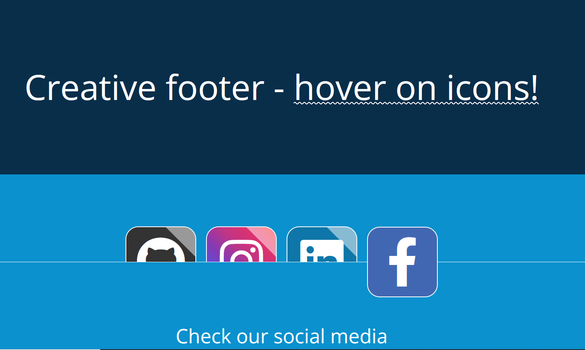

# Responsive Social Media Footer

### Built with

- HTML5
- CSS
    -   BEM Methodology
    -   Variables
    -   Pseudoelement
- Flexbox
- FontAwsome Icons

## Screenshots
Desktop View 

Mobile View

## Author

-   [@kotorozec](https://github.com/kotorozec)

## Demo

https://social-media-footer-with-hover.netlify.app/
